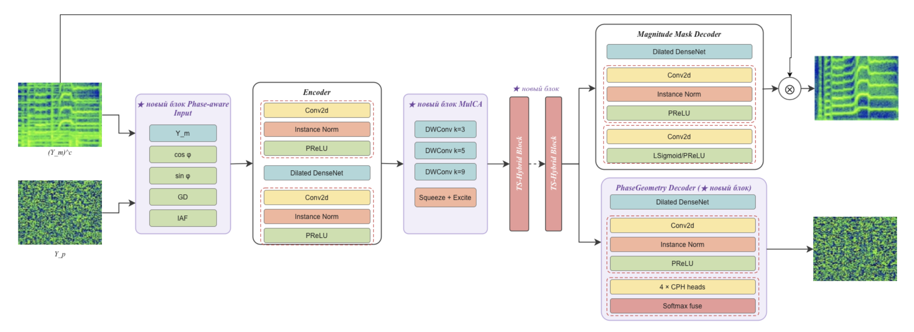

# Geoformer-Phase++

Single-channel speech enhancement with explicit phase reconstruction. The architecture builds on MP-SENet and extends it in three ways: a geometry-based phase decoder that produces several phase candidates (PhaseGeometryDecoder), multi-scale channel attention (MulCA) right after the encoder, and hybrid TS blocks where self-attention is paired with a lightweight recurrent-convolutional "memory" branch. Training and evaluation are done on VoiceBank+DEMAND (16 kHz).

The best configuration (A5) reaches PESQ 3.57 and CBAK 4.02 with 2.67M parameters. With PCS post-processing it reaches PESQ 3.72, which is on par with Mamba-SEUNet+PCS at less than half the model size. The lightweight A6 variant (PESQ 3.48) shrinks the network roughly 2.5× with almost no loss in quality.

## Architecture



## Repository layout

```
.
├── train.py                  # training (single- or multi-GPU, DDP)
├── inference.py              # run the model over a folder of wav files
├── config.yaml               # main config (= the A5 configuration)
├── configs/ablations/        # ablation configs A0–A6
├── models/
│   ├── model.py              # MPNet, decoders, MulCA, TS blocks, losses
│   ├── transformer.py        # transformer block with a GRU-FFN
│   ├── conformer.py          # conformer (not used in the main model)
│   └── discriminator.py      # MetricDiscriminator + async PESQ scoring
├── dataset.py                # dataset, STFT/iSTFT
├── utils.py                  # config, checkpoints, sigmoids
├── cal_metrics/              # PESQ/CSIG/CBAK/COVL/SSNR/STOI computation
├── calculate_checkpoint_PESQ.py  # legacy script for the original MP-SENet
└── ckpts/                    # trained A5 and A6 checkpoints with their configs
```

## Installation

The project is set up with uv, Python ≥ 3.13, and PyTorch ≥ 2.10. The easiest path:

```bash
git clone <repo-url>
cd Geoformer-PhasePP
uv sync
```

If you don't use uv, install the dependencies from `pyproject.toml` with plain pip into a clean environment. The `requirements.txt` file is left over from the original MP-SENet (torch 1.8.1 and so on) and does **not** match this code — rely on `pyproject.toml` instead.

A CUDA GPU is needed for training. Inference also runs on CPU, just noticeably slower.

## Data preparation

A standard VoiceBank+DEMAND resampled to 16 kHz is expected. Four paths are set in `config.yaml`:

```yaml
paths:
  input_clean_wavs_dir: ../../datasets/VoiceBank+DEMAND/wav_clean
  input_noisy_wavs_dir: ../../datasets/VoiceBank+DEMAND/wav_noisy
  input_training_file: ../../datasets/VoiceBank+DEMAND/training.txt
  input_validation_file: ../../datasets/VoiceBank+DEMAND/test.txt
```

Clean and noisy files must share the same names and live in their respective folders. The `training.txt`/`test.txt` lists are line-based with a `|` separator; the filename is taken from the second field of each line (see `get_dataset_filelist` in `dataset.py`). Resampling to the target rate happens on the fly through torchcodec, so you don't have to pre-convert the audio.

## Training

Single GPU:

```bash
python train.py --config config.yaml
```

### Ablations

All experiment configs live in `configs/ablations/` and run with the same command:

```bash
python train.py --config configs/ablations/A5_full_stack.yaml
```

| Config | What's enabled |
|---|---|
| A0 | base: no curriculum, no MulCA, no hybrid blocks |
| A1 | A0 + curriculum + robust validation-PESQ settings |
| A2 | A1 + MulCA |
| A3 | A1 + hybrid TS blocks |
| A4 | A1 + 5 phase candidates + sparse reliability regularization |
| A5 | full stack (A1 + A2 + A3 + A4) — the main model |
| A6 | A5 slimmed down: dense_channel=48, 3 TS blocks, dense_depth=3 |

Each config has its own `checkpoint_path`, so experiments don't overwrite each other.

## Inference

Two trained generators ship in `ckpts/`: `a5_g_best` (main model) and `a6_g_best` (lite). The inference script looks for `config.yaml` next to the checkpoint, so lay the files out first:

```bash
mkdir -p runs/a5
cp ckpts/a5_g_best runs/a5/g_best
cp ckpts/a5_config.yaml runs/a5/config.yaml
```

Then:

```bash
python inference.py \
    --checkpoint_file runs/a5/g_best \
    --input_noisy_wavs_dir /path/to/noisy_wavs \
    --output_dir generated_files
```

The script walks every `.wav` in the given folder and writes the enhanced versions, with the same names, into `output_dir`. On GPU, inference runs in bfloat16 with `torch.compile(dynamic=True)`; the first file takes longer because of compilation — that's expected.

The same works for your own checkpoints: after training, just point `--checkpoint_file` at `<checkpoint_path>/g_best`, the config is already there.

## Computing metrics

The standard VoiceBank+DEMAND set (PESQ, CSIG, CBAK, COVL, SSNR, STOI):

```bash
cd cal_metrics
python cal_metrics_vb.py \
    --clean_wav_dir /path/to/testset_clean \
    --noisy_wav_dir /path/to/generated_files
```

Run it from inside the `cal_metrics` folder — the script imports the neighboring `compute_metrics.py`. Filenames in both folders must match. For DNS-style data there's `cal_metrics_dns.py` with the same interface.

`calculate_checkpoint_PESQ.py` is an old helper with hard-coded paths for the original MP-SENet checkpoints; it isn't directly compatible with the current model signature and is kept in the repo for reference.

## Reproducibility

The seed is fixed in the config (`seed: 42`) and applied to python/numpy/torch. With `cudnn.benchmark` and `torch.compile` enabled you shouldn't expect bit-exact reproducibility, but the final metrics vary within a few hundredths of PESQ across reruns.

## Acknowledgements

The code grew out of the open [MP-SENet](https://github.com/yxlu-0102/MP-SENet) implementation (Lu et al., 2023) — the dense encoder/decoders, the metric-discriminator training scheme, and the data pipeline come from there.
